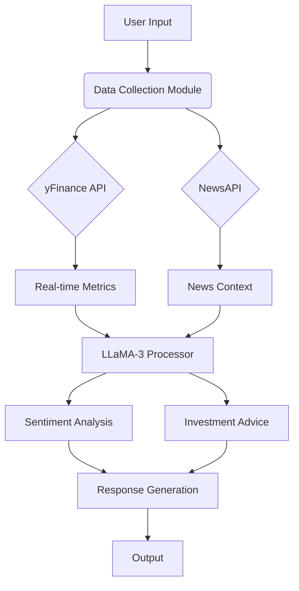

# Finance Chatbot: Sentiment Analysis & Investment Advisor 


**Author**: Atharva Kulkarni

## Key Features
- **Sentiment Analysis** of financial news/text using fine-tuned LLaMA-3
- **Investment Recommendations** with real-time stock metrics integration
- **Financial Q&A** system with contextual understanding
- **LoRA-optimized** fine-tuning for efficient adaptation
- Real-time data integration with Yahoo Finance & NewsAPI

## Technical Stack
| Component               | Technology                          |
|-------------------------|-------------------------------------|
| Base Model              | Meta-Llama-3-8B-Instruct            |
| Fine-tuning Framework   | Unsloth                             |
| Quantization            | 4-bit QLoRA                         |
| Data Processing         | Pandas, Hugging Face Datasets       |
| Real-time Data          | yfinance, NewsAPI                   |
| Deployment              | Transformers, PEFT                  |

## Installation
```bash
# Clone repository
git clone https://github.com/Atharvack/LLM-Finetuning-Yfinance.git
cd finance-chatbot

# Additional setup
pip install "unsloth[colab-new] @ git+https://github.com/unslothai/unsloth.git"
pip install --no-deps xformers trl peft accelerate bitsandbytes
```

##  Usage
### Fine-tuning Process

```python
from unsloth import FastLanguageModel

# Initialize model with LoRA
model, tokenizer = FastLanguageModel.from_pretrained(
  model_name="meta-llama/Meta-Llama-3-8B-Instruct",
  max_seq_length=1024,
  load_in_4bit=True,
  token="your_hf_token"
)

# Start training
trainer = SFTTrainer(
  model=model,
  train_dataset=dataset,
  dataset_text_field="text",
  max_seq_length=1024,
  # ... additional config
)
trainer.train()
```

### Real-time Inference

```python
# Initialize chatbot interface
def main():
  context = build_context()  # Collects real-time data
  while True:
    question = input("Ask financial question: ")
    response = inference(question, context)
    print(f"Assistant: {extract_response(response)}")
```

##  System Architecture



##  Dataset
- **QA_plus_sentiment_12k.csv** containing:
  - Financial questions
  - Contextual information
  - Annotated answers
  - Sentiment labels

## Configuration
1. Obtain [Hugging Face Token](https://huggingface.co/settings/tokens)
2. Get [NewsAPI Key](https://newsapi.org/register)
3. Update `hf_token` and `api_key` in code

## License
MIT License - See [LICENSE](LICENSE) for details

---

**Disclaimer**: This project is for educational purposes only. Never make actual financial decisions based on AI outputs without consulting qualified professionals.

## Jupyter Notebooks

<div id="notebook-content"></div>

<script>
  fetch('fine_tuning_inference.html')
  .then(response => response.text())
  .then(data => {
    document.getElementById('notebook-content').innerHTML = data;
  });
</script>

